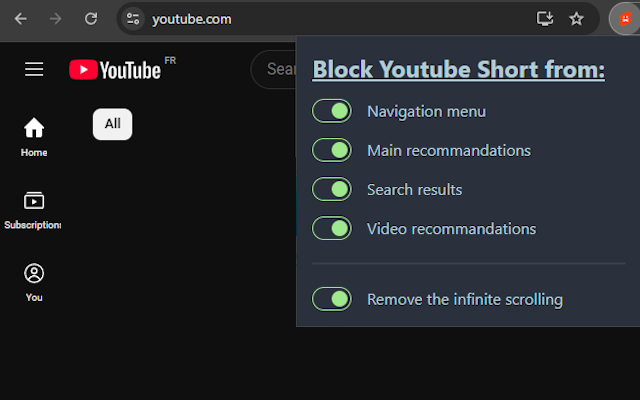

  

<h1 align="center">YouTube Shorts Blocker</h1>

  A simple Chrome extension to block YouTube Shorts content and avoid infinite scrolling.

---

## ✨ Features

-   ✅ Hide the **Shorts button** in the navigation menu
-   ✅ Hide Shorts in **homepage recommendations**
-   ✅ Hide Shorts in **search results**
-   ✅ Hide Shorts in **video side recommendations**
-   ✅ Automatically redirect `/shorts/...` pages to the standard `/watch?v=...` player
-   ✅ Simple and intuitive popup configuration
-   ✅ Preferences are saved using Chrome's storage API

---

## 📸 Preview

  

---

## ⚙️ Installation

### 📦 Manual Installation (ZIP version)

If you downloaded the pre-built `chrome-extension.zip` from the root folder:

1. Unzip the file anywhere on your computer

2. Open `chrome://extensions/` in your browser

3. Enable **Developer Mode** (top right corner)

    > _(required even for manual install from ZIP)_

4. Click **"Load unpacked"**

5. Select the folder you just unzipped (it should contain the `manifest.json` file)

### 🔧 Installation (Development Mode)

1. Clone this repository:

    git clone https://github.com/your-username/youtube-shorts-blocker.git  
    cd youtube-shorts-blocker

2. Install dependencies:

    npm install

3. Build the project:

    npm run build

4. Open `chrome://extensions/` in your browser

5. Enable **Developer Mode** (top right corner)

6. Click **"Load unpacked"** and select the `dist/` folder

---

## 🧠 Permissions Required

-   `storage` – to store user preferences
-   `scripting` – to inject content scripts into YouTube pages
-   `*://www.youtube.com/*` – to run only on YouTube and apply the blocking rules

---

## 📦 Publishing

This extension is built using Manifest V3 and is waiting for approval for the Chrome Web Store.

---

## 🤝 Contributing

Contributions are welcome!  
Feel free to open an issue or submit a pull request to fix bugs, suggest features, or improve the code.

---

## 📄 License

[MIT](./LICENSE.txt)

---

## 💬 Contact

You can reach me through GitHub if you have any questions, feedback, or ideas for improvement.
